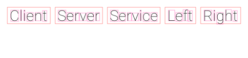

# seq-rs

[](https://codecov.io/gh/rsouth/seq-rs) [](https://github.com/rsouth/seq-rs/actions) [](https://libraries.io/github/rsouth/seq-rs) [](https://www.gnu.org/licenses/gpl-3.0.en.html)

`seq-rs` (published here as the `sequencer` crate/binary) is a small Rust command-line tool for turning a plain-text sequence diagram DSL into a PNG image.

## What this repository contains

At a high level, the codebase is split into a few focused layers:

- `src/cli.rs` defines the command-line interface with `clap`
- `src/main.rs` loads input from `--file`, `-e` (example), or stdin and runs the pipeline
- `src/parsing/` converts text lines into structured document, participant, and interaction data
- `src/diagram.rs` assembles parsed data into a `Diagram`
- `src/rendering/` draws participants and text into a PNG with `raqote` and `fontdue`
- `src/theme.rs` owns embedded fonts and layout constants
- `benches/` contains Criterion benchmarks for parsing and rendering hot paths

The current flow is:

1. Read input text
2. Parse each line into metadata/comments/interactions
3. Discover participants and interaction directions
4. Build a `Diagram`
5. Render the diagram to a PNG file

## Key technologies

- **Rust 2021** for the CLI and library code
- **clap** for argument parsing
- **regex** for the document-level DSL parsing
- **fontdue** for text measurement and glyph rasterization
- **raqote** for PNG drawing
- **criterion** for benchmarks

## Repository structure

```text
.
├── assets/                  # Embedded fonts used by the default theme
├── benches/                 # Criterion benchmark suites
├── docs/                    # Checked-in example output used by the README
├── src/
│   ├── cli.rs               # CLI definition
│   ├── diagram.rs           # Diagram assembly
│   ├── lib.rs               # Library module exports and shared type aliases
│   ├── main.rs              # Program entry point
│   ├── model.rs             # Core domain types
│   ├── parsing/             # Document, participant, and interaction parsers
│   ├── rendering/           # Rendering context, sizing, and text drawing
│   └── theme.rs             # Default fonts and spacing
├── .github/workflows/       # Build and test automation
├── AGENTS.md                # Working notes for future contributors/agents
└── README.md                # Project overview and quick start
```

## Input format

The DSL is intentionally simple:

```text
:theme Default
:title Example Sequence Diagram
:author Mr. Sequence Diagram
:date today

Client -> Server: Request
Server -> Server: Parses request
Server ->> Service: Query
Service -->> Server: Data
Server --> Client: Response
```

- Metadata lines start with `:`
- Comment lines start with `#`
- Interaction lines use arrows like `->`, `-->`, `->>`, and `-->>`
- A message is optional and follows `:`

## Running the project

On Ubuntu-based systems, install the native font dependency first:

```bash
sudo apt-get update
sudo apt-get install -y libfontconfig1-dev
```

Then:

```bash
cargo build
cargo test
```

To generate the built-in example image:

```bash
cargo run -- -e docs/example-output.png
```

To render your own file:

```bash
cargo run -- --file path/to/diagram.seq output.png
```

If no file or example flag is provided, the binary reads from stdin.

## Example output

The image below was generated from the built-in example input using the current renderer:



## Development notes

- The CI workflow in `.github/workflows/build_and_test.yml` installs `libfontconfig1-dev`, then runs `cargo build --verbose` and `cargo test --verbose`
- The renderer currently focuses on participant boxes and text placement; the parsing and rendering layers are intentionally small and easy to trace
- See `AGENTS.md` for a fuller guide to the codebase and recommended collaboration workflow
