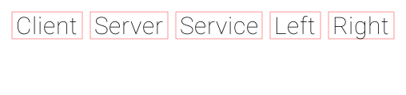

# seq-rs

[](https://github.com/rsouth/seq-rs/actions)
[](https://codecov.io/gh/rsouth/seq-rs)
[](https://libraries.io/github/rsouth/seq-rs)
[](https://www.gnu.org/licenses/gpl-3.0.en.html)

A command-line tool written in Rust that converts a plain-text sequence diagram DSL into a rendered PNG image.

---

## Example output

Given the following input:

```
:title Example Sequence Diagram
:author Mr. Sequence Diagram
:date 2024-01-01

# diagram
Client -> Server: Request
Server -> Server: Parses request
Server ->> Service: Query
Service -->> Server: Data
Server --> Client: Response
Left -> Right
```

seq-rs produces:



---

## Installation

### Prerequisites

On Ubuntu/Debian, install the system font library before building:

```bash
sudo apt-get install -y libfontconfig1-dev
```

### Build from source

```bash
git clone https://github.com/rsouth/seq-rs.git
cd seq-rs
cargo build --release
# binary is at target/release/sequencer
```

---

## Usage

```
sequencer [OPTIONS] <output>

Arguments:
  <output>   Path to write the output PNG file

Options:
  -f, --file <file>   Read diagram input from a file
  -e                  Use the built-in example diagram
  -h, --help          Print help
  -V, --version       Print version
```

### Examples

**Render from a `.seq` file:**

```bash
sequencer --file path/to/diagram.seq output.png
```

**Render from stdin:**

```bash
echo "Client -> Server: Hello" | sequencer output.png
```

**Render the built-in example diagram:**

```bash
sequencer -e output.png
```

**Enable verbose logging:**

```bash
RUST_LOG=info sequencer -e output.png
RUST_LOG=debug sequencer -e output.png
```

---

## DSL Syntax

```
# Lines starting with '#' are comments and are ignored.

# Metadata directives (colon-prefixed, written before interactions):
:title  My Diagram Title
:author Author Name
:date   2024-01-01
:theme  Default

# Interaction lines  —  <From> -> <To>  or  <From> -> <To>: Message
Client -> Server: Request
Server -> Server: Self-reference
Server --> Client: Reply
Server ->> Service: Async request
Service -->> Server: Async reply
```

### Rules

| Line type | Syntax | Notes |
|---|---|---|
| Comment | `# text` | Ignored completely |
| Title | `:title <text>` | Diagram heading |
| Author | `:author <text>` | Author metadata |
| Date | `:date <text>` | Date metadata (requires at least one word after `:date`) |
| Theme | `:theme <name>` | Visual theme selection (currently `Default` only) |
| Interaction | `A -> B` | Arrow from participant A to participant B |
| Interaction with message | `A -> B: message` | Arrow with label |

Arrow style variants (`->`, `-->`, `->>`, `-->>`) are all parsed — they are not yet visually differentiated.

Participants are discovered implicitly in the order they first appear in the file, which determines their left-to-right visual order.

---

## Development

### Run tests

```bash
cargo test
```

### Run benchmarks

```bash
cargo bench
```

### Run with logging

```bash
RUST_LOG=debug cargo run -- -e output.png
```

---

## Project layout

```
seq-rs/
├── Cargo.toml              # Package metadata and dependencies
├── assets/                 # Fonts embedded at compile time
│   ├── Roboto-Thin.ttf
│   ├── Roboto-Black.ttf
│   └── OpenSans-Regular.ttf
├── benches/                # Criterion benchmarks
├── docs/                   # Documentation assets (e.g. example.png)
├── src/
│   ├── main.rs             # Binary entry point
│   ├── cli.rs              # CLI definitions (clap)
│   ├── lib.rs              # Library root and type aliases
│   ├── model.rs            # Core domain types
│   ├── diagram.rs          # Diagram assembly
│   ├── theme.rs            # Visual theme (fonts, sizes, spacing)
│   ├── parsing/
│   │   ├── document.rs     # Text → Vec<Line>
│   │   ├── participant.rs  # Lines → ParticipantSet
│   │   └── interaction.rs  # Lines → InteractionSet
│   └── rendering/
│       ├── mod.rs          # Render traits, PNG output
│       └── text.rs         # Font layout and glyph rasterisation
└── .github/workflows/
    ├── build_and_test.yml  # CI: build + test on every push/PR
    └── codecov.yml         # Coverage upload to Codecov
```

---

## License

[GNU General Public License v3.0](https://www.gnu.org/licenses/gpl-3.0.en.html)
